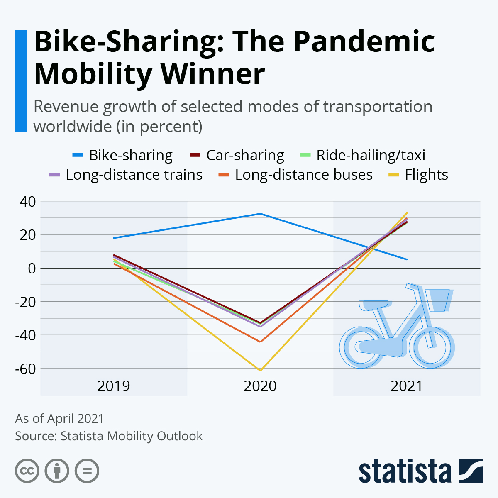

# Repositório com manipulações básicas em Python para identificar questões relacionadas a estatísticas de compartilhamento de bicicletas

 Imagem para fins de instrução, informação não extraída do trabalho 

